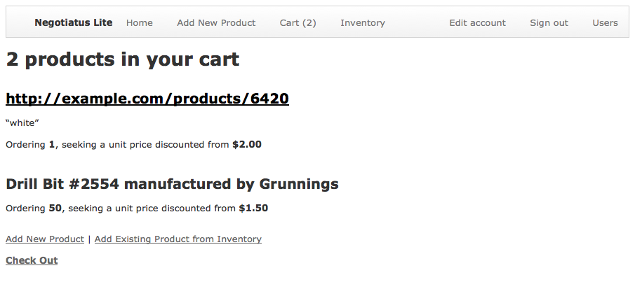

# Negotiatus Lite demo app

This Ruby on Rails app demonstrates my competence with Rails, by reimplementing a small part of the website [Negotiatus](https://www.negotiatus.com/). Negotiatus is a web app for business procurement on which customers can enter products and request discounts to be negotiated for them. I implement a bare-bones version of the user system, creation of products, adding products to a cart, and viewing your inventory of previously-ordered products.

You can [play with my live app](https://rory-negotiatus-lite.herokuapp.com/) on Heroku.

## Notable Rails features I demonstrate use of

- **Custom validations**. The Add Product page validates that the URL or the name/manufacturer fields are filled in, but not both. It has custom error messages depending on whether both the URL and one of the name or manufacturer was filled (indicating conflict) or just one of name or manufacturer was filled (indicating incompleteness).
- **`fields_for`**. The Add Product page lets you create two new model objects simultaneously: a new `Product`, and a new `CartItem` that references that product. The page uses `fields_for` to efficiently create the part of the form that lets you edit the nested product’s attributes.
- The **Devise** third-party library for authorization. Users can create accounts and log in or out using dynamic links on the navigation bar. When you create a product, it is automatically assigned to the current user. On each page, I only show items that belong to the current user.

## Credits

The initial version of the app was based on a template from `rails_app_composer`. The template provided support for users with Devise, a default page layout, and some default styles. I implemented everything else.

## License

All my contributions to this app are licensed with the [Unlicense](http://unlicense.org/) (released into the public domain).
